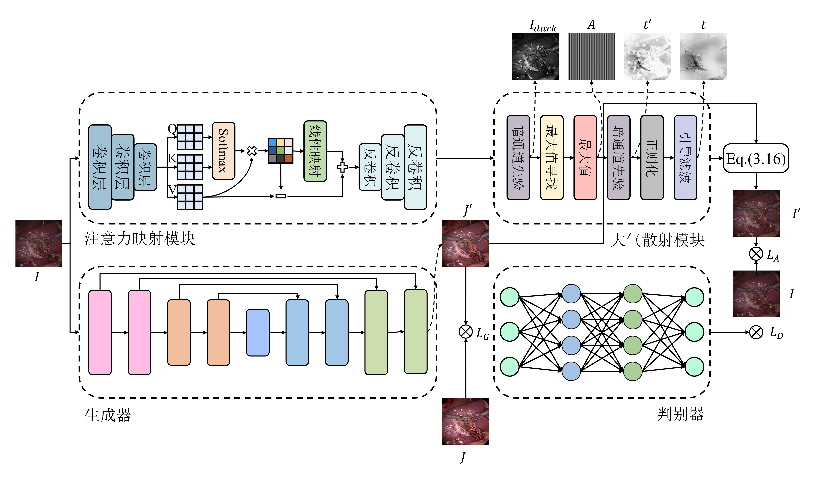

# 基于生成对抗网络和大气散射模型的手术图像去雾算法




## 数据集

### 1. 数据集下载
Cholec80<sup>1</sup>：[Progressive Frequency-Aware Network for Laparoscopic Image Desmoking](https://drive.google.com/file/d/1n_-AzgmQcUWt9VMkTvuZnewJXNHCB7_o/view)

Cholec80<sup>2</sup>：[Attention-Aware Laparoscopic Image Desmoking Network with Lightness Embedding and Hybrid Guided Embedding](https://osf.io/bgza5/files/osfstorage)

### 2. 数据集配置


```shell
# 创建数据集文件夹：
mkdir dataset
cd dataset

# Cholec801数据集
mkdir cholec801
python ./util/align_dataset.py # 对齐smoke与clear
python ./utilenerate_aligned_dataset.py # 生成aligned_dataset的数据集格式

# Cholec802数据集
mkdir cholec802
python ./util/divide_dataset.py # 划分为cyclegan模式
python ./util/generate_aligned_dataset.py # 生成align_dataset的数据集格式
```

## 训练

```shell
python train.py --dataroot dataset_path --name name --model pix2pix --netG unet_128 --netD basic --direction AtoB --dataset_mode aligned --norm batch --token_projection conv --embed_dim 64 --ndf 64 --ngf 64
```

## 测试

```shell
python train.py --name AtmosphereCycleGANResnet6 --model atmosphere_cycle_gan --netG resnet_6blocks --netD basic --direction AtoB --dataset_mode aligned --norm batch --token_projection conv --embed_dim 64 --ndf 64 --ngf 64
```

## 注

训练`cycle_gan`和`pix2pix`架构时，修改`./util/visualizer.py`文件中416行。

```python
im_GT = images[3].transpose([1, 2, 0]) # cyclegan
im_GT = images[2].transpose([1, 2, 0]) # pix2pix
```